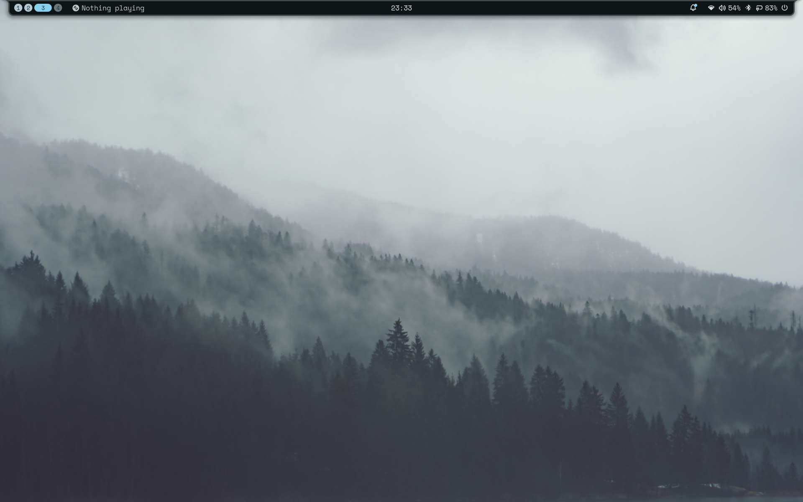
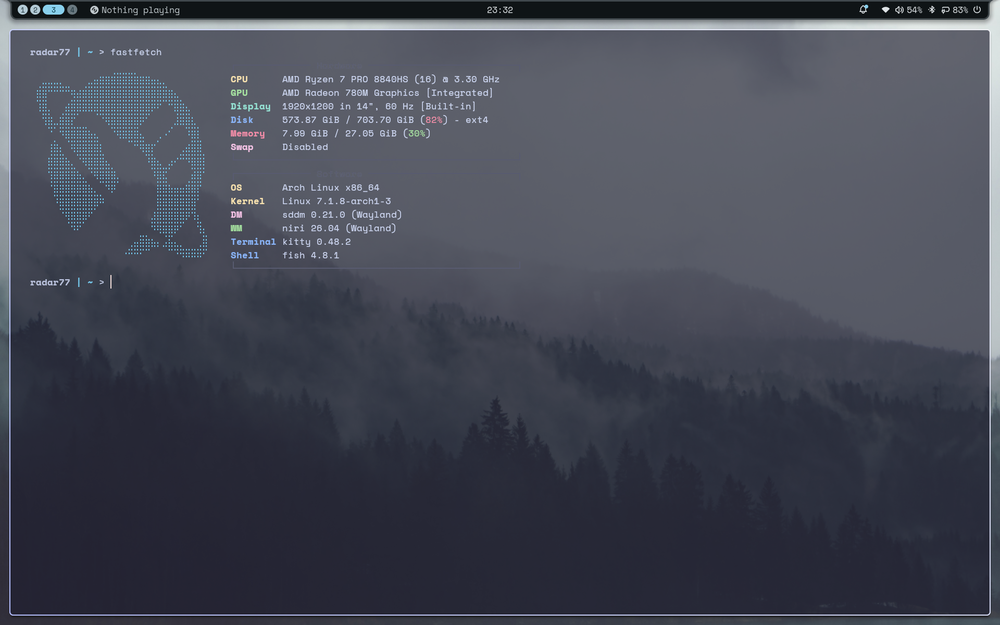

# Ch0p's System Config
My configurations for my system

## INSTALLATION
- Copy `config/*` into `~/.config`
- Copy `nixos-config/*` into `/etc/nixos`

## INCLUDED
### System Configurations
- NixOS

### App Configuratons
- neovim
- fastfetch
- kitty
- niri
- fish
- noctalia
- cava
- gtk 3.0 and 4.0
- ranger 

## RICE HISTORY
| Empty | Populated |
|---|---|
| | |
| | |
| | |
